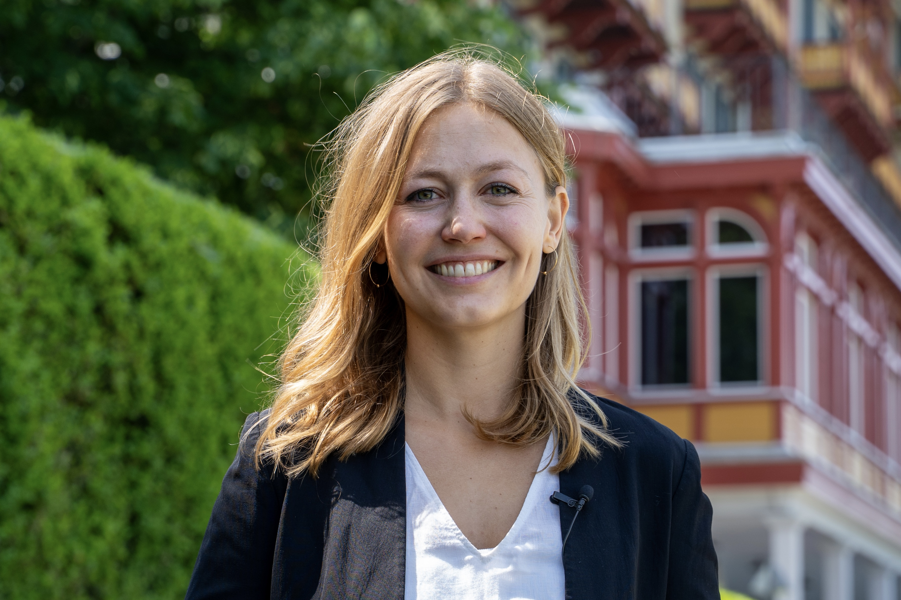

:::: {.columns}

::: {.column width="38%"}
{.rounded style="width:100%; border-radius: 50%;"}
:::

::: {.column width="5%"}
:::

::: {.column width="57%"}
## Clara Brügge

Welcome! I am a PhD candidate at the Chair for International Political Economy and Environmental Politics at ETH Zürich, where I work under the supervision of Thomas Bernauer. In spring 2026, I was a visiting PhD student at Universitat Pompeu Fabra in Barcelona.

My research focuses on the challenges of technology-based climate change mitigation: how citizens perceive and respond to its costs and trade-offs, and what this implies for the political feasibility of ambitious climate policy. Methodologically, I specialize in quantitative approaches, especially survey experiments.

In parallel, I serve as Project Manager of the Swiss Environmental Panel, a biannual longitudinal survey on environmental attitudes and policy preferences run in collaboration with the Federal Office for the Environment. Prior to my doctoral studies, I was a Carlo Schmid Fellow at the OECD, worked as a consultant for the UN Environment Programme, and interned at the German Permanent Mission to the UN.

[cbrugge@ethz.ch](mailto:cbrugge@ethz.ch) · [GitHub](https://github.com/clbruegge)

:::

::::
